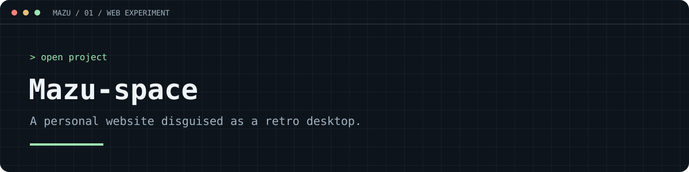

# A little desktop you can visit

**Mazu-space** is my portfolio, blog and digital playground, wrapped in a retro computer interface. Open a window, put on some music and explore.

### [Enter the desktop → mazu.is-a.dev](https://mazu.is-a.dev)


**React 18 · Vite 5 · JavaScript · CSS**

## Inside the desktop

- Draggable, resizable and minimizable windows.
- CRT scanlines, noise overlays and a boot sequence.
- A music player and audio oscilloscope.
- Markdown blog posts with syntax highlighting.
- Discord presence through Lanyard.
- A separate mobile interface.

## Run it locally

Install Node.js and npm, then:

```bash
git clone https://github.com/Il-Mazu/Mazu-space.git
cd Mazu-space
npm install
npm run dev
```

Open the local URL Vite prints in your terminal (normally **http://localhost:5173**).

```bash
npm run build     # production files in dist/
npm run preview   # preview the production build
```

## Explore the code

| Path | What's there |
| --- | --- |
| `src/App.jsx` | Desktop state, windows and music logic |
| `src/components/` | Desktop windows, mobile views, taskbar and boot screen |
| `src/hooks/` | Discord presence and screen-mode hooks |
| `src/blog/` | Markdown posts and post loader |
| `src/utils/audio.js` | Audio helpers |
| `src/index.css` | Global styling |
| `assets/` | Music, cover art, wallpaper and ambient assets |

## Make it yours

Start with the home/about components and blog posts, then update the assets and presence configuration. Vercel Analytics and Speed Insights are integrated in the source; review those integrations when adapting the project. Check rights separately before reusing music, artwork or other media.

Found a layout or audio bug? Include your browser, screen size and reproduction steps in an issue.

Built by [Marco / Il-Mazu](https://github.com/Il-Mazu).
